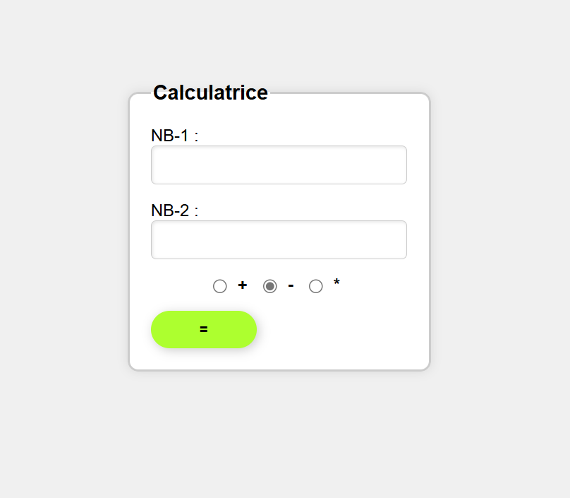

# Simple-PHP-Calculator
A simple and elegant web-based calculator built with PHP and HTML, styled with CSS. This project demonstrates basic form handling in PHP and provides a clean and user-friendly interface for performing basic arithmetic operations.

